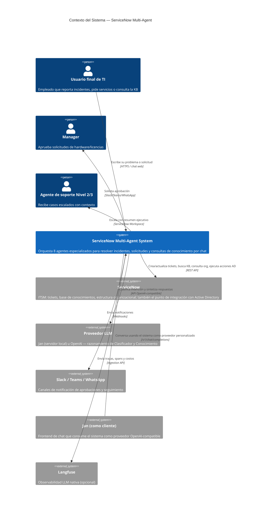

# Nivel 1 — Diagrama de Contexto

Muestra el sistema como una única caja, y quién/qué interactúa con él. Es la
vista para alguien que nunca vio el proyecto: "¿qué hace esto y con qué
otros sistemas habla?"

## Actores

| Actor | Rol |
|-------|-----|
| **Usuario final de TI** | Reporta incidentes, pide servicios (hardware, licencias), consulta la KB, consulta el estado de sus tickets — todo en lenguaje natural. |
| **Manager** | Recibe la notificación de aprobación (Slack/Teams/WhatsApp) cuando una solicitud de un reporte directo la requiere. |
| **Agente de soporte Nivel 2/3** | Recibe el caso en el Workspace de ServiceNow cuando el sistema no puede resolverlo solo, con el resumen ejecutivo del diagnóstico ya construido — nunca una transferencia fría. |

## Sistemas externos

| Sistema | Para qué se usa | Modo |
|---------|------------------|------|
| **ServiceNow** | Tickets, KB (fuente del RAG), estructura organizacional, acciones de AD (desbloqueo, reset de contraseña) | LIVE (REST) / DEMO (simulado en memoria, sin credenciales) |
| **Proveedor LLM** (Jan / OpenAI) | Razonamiento de 2 de los 8 agentes (Clasificador, Conocimiento) — el resto son deterministas por diseño | `jan` / `openai` / `mock` |
| **Slack / Teams / WhatsApp** | Notificar aprobaciones y actualizaciones de ticket | LIVE (webhooks) / DEMO (log) |
| **Jan** (rol dual) | (a) proveedor del LLM local en el puerto 1337; (b) cliente que consume `/v1/chat/completions` del sistema en el puerto 8000 — son dos roles y dos conexiones distintas, no confundirlos | — |
| **Langfuse** | Observabilidad LLM nativa: trazas, spans, costos automáticos | Opcional — solo si `LANGFUSE_PUBLIC_KEY`/`LANGFUSE_SECRET_KEY` están configuradas |

**Nota sobre Active Directory:** el código no tiene una integración directa
con AD — las acciones de desbloqueo/reset de contraseña pasan por
`ServiceNowAdapter`, que en modo LIVE llamaría a un flow/scripted REST API
de ServiceNow que a su vez toca AD. Se documenta así para reflejar el
código real, no una integración directa que no existe.
