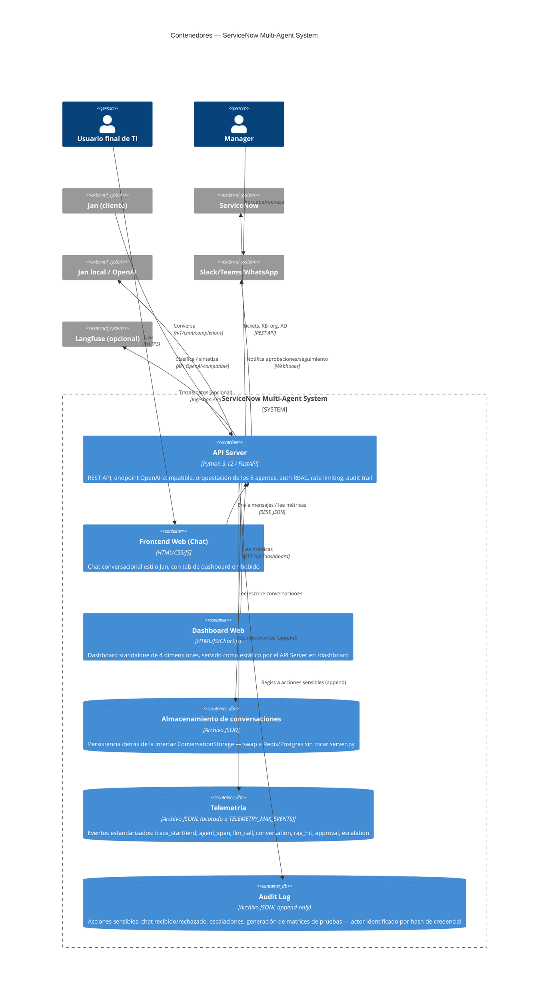

# Nivel 2 — Diagrama de Contenedores

Hace zoom dentro de la caja "ServiceNow Multi-Agent System" del Nivel 1:
¿de qué piezas desplegables está hecho? Un "contenedor" en C4 es algo que
se ejecuta de forma independiente (un proceso, una app, un almacén de
datos) — no confundir con Docker.

## Contenedores

| Contenedor | Tecnología | Responsabilidad | Puerto (dev) |
|---|---|---|---|
| **API Server** | Python 3.12, FastAPI, Uvicorn | Único punto de entrada: REST propia, endpoint OpenAI-compatible, orquestación de agentes, auth/rate-limit, exception handling tipado, sirve el dashboard estático | 8000 |
| **Frontend Web (Chat)** | HTML/CSS/JS vainilla | UI de chat + tab de dashboard; se sirve con cualquier servidor estático | 8080 (sugerido) |
| **Dashboard Web** | HTML/JS + Chart.js (CDN) | Vista standalone de las 4 dimensiones; montada por el API Server en `/dashboard` | 8000 (vía API Server) |
| **Almacenamiento de conversaciones** | JSON en disco (`DATA_DIR/conversations.json`) | Historial de conversaciones, detrás de `ConversationStorage` (Protocol, ver Nivel 4) | — |
| **Telemetría** | JSONL en disco (`DATA_DIR/telemetry.jsonl`) | Log de eventos append-only que alimenta `MetricsEngine` (acotado en memoria por `TELEMETRY_MAX_EVENTS`) | — |
| **Audit Log** | JSONL en disco (`DATA_DIR/audit.jsonl`) | Rastro inmutable de acciones sensibles, actor = hash de la credencial | — |

## Decisiones de contenedor

- **Un solo proceso backend** (no microservicios): a esta escala, separar
  los 8 agentes en servicios independientes agregaría latencia de red y
  complejidad operativa sin beneficio real — son módulos Python dentro del
  mismo proceso FastAPI (ver Nivel 3).
- **Sin base de datos por defecto**: los dos "contenedores de datos" son
  archivos planos para que el sistema corra con cero infraestructura en
  modo DEMO. `ConversationStorage` (Nivel 4) es el punto de extensión para
  reemplazarlos por Redis/Postgres sin reescribir `server.py`.
- **Jan aparece en dos roles**: como *contenedor externo* que provee el LLM
  (puerto 1337, consumido por el API Server), y como *cliente externo* del
  API Server (puerto 8000, vía `/v1/chat/completions`) — son conexiones en
  direcciones opuestas.
- **Seguridad por configuración, no por diseño de contenedores**: no hay un
  API Gateway/proxy separado — autenticación RBAC, rate limiting, redacción
  de PII, audit trail y CORS se aplican dentro del propio API Server
  (`backend/security/`), suficiente a esta escala; ver
  [07_GUARDRAILS.md](../llmops/07_GUARDRAILS.md) y
  [docs/SEGURIDAD.md](../SEGURIDAD.md).
- **Configuración centralizada** (`backend/config.py`): `DATA_DIR`,
  `CORS_ORIGINS` y el modo `APP_ENV` (development/production) se validan al
  arrancar — en producción, sin `API_KEYS`/`CORS_ORIGINS` el proceso falla
  rápido en vez de arrancar inseguro.
