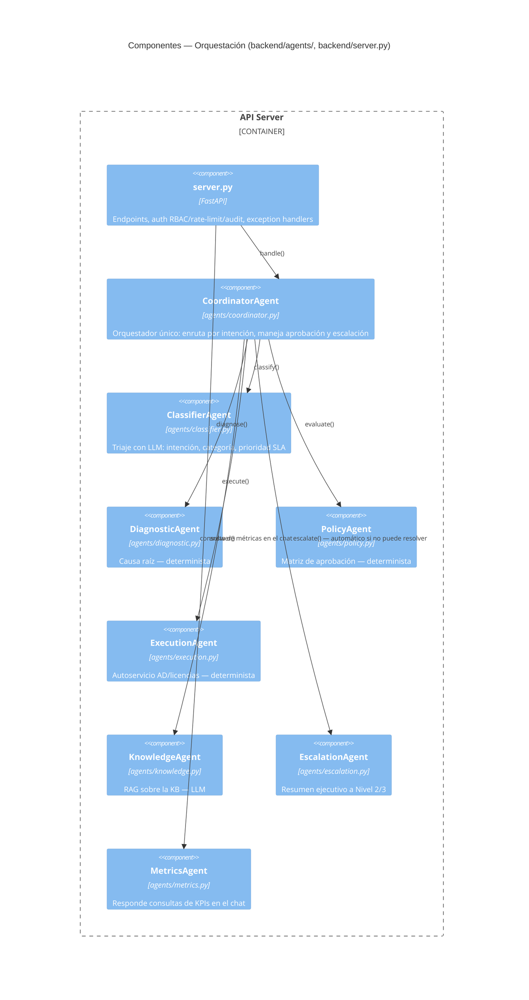

# Nivel 3 — Diagrama de Componentes

Hace zoom dentro del contenedor **API Server**: sus módulos internos y cómo
se llaman entre sí. Se divide en dos vistas para que cada diagrama sea
legible — mapean directamente a los paquetes de `backend/` (ver también
[03_DESARROLLO.md](../llmops/03_DESARROLLO.md)).

## 3a. Orquestación y agentes

**Flujo de enrutamiento** (ver diagramas de secuencia en
[04_CODIGO.md](04_CODIGO.md)): `Coordinator` clasifica primero y, según la
intención, va a `Knowledge`, a Seguimiento (estado), o a la cadena
`Diagnostic → Policy → Execution`. Si en cualquier punto de esa cadena no
hay una acción automatizable o la ejecución falla, `Coordinator` llama a
`Escalation` **automáticamente** — no es un camino manual ni un endpoint
aparte que alguien tenga que invocar.

## 3b. Infraestructura transversal

```mermaid
C4Component
    title Componentes — LLMOps, Observabilidad, Adapters, Core

    Container_Boundary(api, "API Server") {
        Component(llm_facade, "LLM (Facade)", "core/llm.py", "Model-agnóstico: Mock / OpenAI-compatible vía Strategy; retry con backoff")
        Component(guardrails, "Guardrails", "llmops/guardrails.py", "Validación de entrada/salida, anti-inyección de prompt")
        Component(prompts, "PromptRegistry", "llmops/prompts.py", "Prompts versionados (compone patterns.Registry)")
        Component(evals, "Evaluator", "llmops/evals.py", "Checks deterministas + LLM-as-judge (compone patterns.Registry)")
        Component(errors, "LLMOpsError", "llmops/errors.py", "Jerarquía de excepciones tipadas + retry()")
        Component(test_matrix, "TestMatrix", "llmops/test_matrix.py", "Generador de casos de prueba (HU-004)")

        Component(auth, "Auth (RBAC)", "security/auth.py", "API key + roles user/agent/admin")
        Component(rate_limit, "RateLimiter", "security/rate_limit.py", "Ventana deslizante por credencial/IP")
        Component(redaction, "Redactor", "security/redaction.py", "Redacción de PII en logs/telemetría")
        Component(audit, "AuditLog", "security/audit.py", "Audit trail append-only de acciones sensibles")

        Component(telemetry, "Telemetry", "observability/telemetry.py", "Eventos JSON estandarizados (buffer acotado)")
        Component(metrics_engine, "MetricsEngine", "observability/metrics.py", "Calcula las 4 dimensiones del dashboard")
        Component(traced_coord, "TracedCoordinator", "observability/traced_coordinator.py", "Envuelve al Coordinador, emite trazas por agente")
        Component(instrumented_llm, "InstrumentedLLM", "observability/instrument.py", "Envuelve al LLM, emite tokens/costo/latencia")

        Component(snow_adapter, "ServiceNowAdapter", "adapters/servicenow.py", "Tickets, KB, org, AD — LIVE/DEMO + retry")
        Component(notif_adapter, "NotificationAdapter", "adapters/notifications.py", "Slack/Teams/WhatsApp — LIVE/DEMO")

        Component(config, "config", "config.py", "Configuración centralizada por entorno (DATA_DIR, CORS, APP_ENV)")
        Component(models, "Modelos de dominio", "core/models.py", "Conversation, Ticket, Classification, AgentMessage")
        Component(storage, "ConversationStorage", "core/storage.py", "Protocol — interfaz de almacenamiento")
        Component(store, "ConversationStore", "core/state.py", "Implementación JSON del Protocol")
    }

    System_Ext(llm_provider, "Jan / OpenAI")
    System_Ext(servicenow, "ServiceNow")
    System_Ext(notif_channels, "Slack/Teams/WhatsApp")

    Rel(llm_facade, llm_provider, "HTTPS")
    Rel(snow_adapter, servicenow, "REST API")
    Rel(notif_adapter, notif_channels, "Webhooks")

    Rel(traced_coord, telemetry, "emit()")
    Rel(instrumented_llm, telemetry, "llm_call()")
    Rel(metrics_engine, telemetry, "load_events()")

    Rel(guardrails, errors, "lanza ValidationError")
    Rel(llm_facade, errors, "lanza ProviderError / RetryableError")
    Rel(snow_adapter, errors, "lanza ProviderError / RetryableError")

    Rel(auth, audit, "actor = key_id (hash de la credencial)")
    Rel(store, storage, "implementa")
    Rel(store, config, "usa DATA_DIR")
    Rel(telemetry, config, "usa DATA_DIR / TELEMETRY_MAX_EVENTS")
```

## Cómo mapea a los paquetes de `backend/`

| Paquete | Componentes | Diagrama |
|---|---|---|
| `agents/` | Coordinator + 7 agentes especializados | 3a |
| `llmops/` | LLM facade, Guardrails, PromptRegistry, Evaluator, errores, TestMatrix | 3b |
| `security/` | Auth (RBAC), RateLimiter, Redactor, AuditLog | 3b |
| `observability/` | Telemetry, MetricsEngine, TracedCoordinator, InstrumentedLLM, LangfuseClient | 3b |
| `adapters/` | ServiceNowAdapter, NotificationAdapter | 3b |
| `core/` | Modelos de dominio, LLMConfig, ConversationStorage/Store | 3b |
| `config.py` | Configuración centralizada por entorno | 3b |
