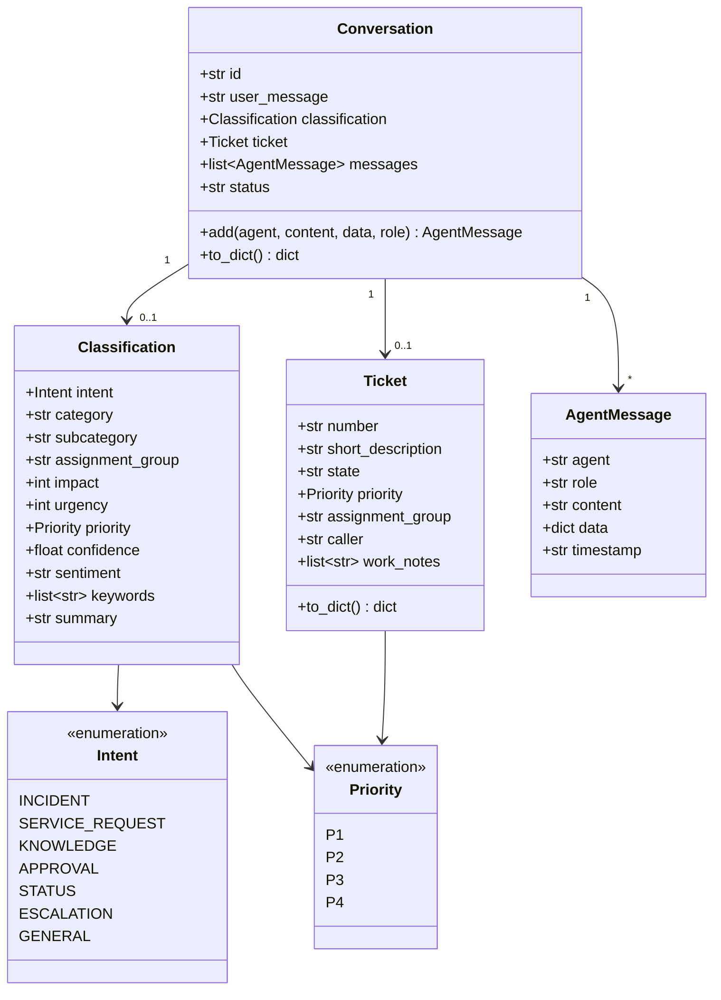
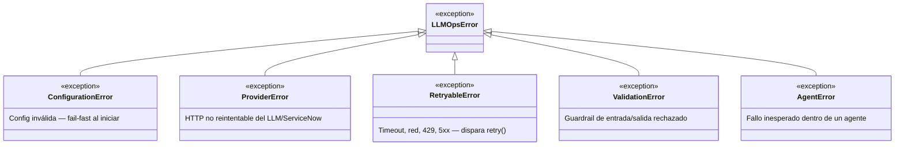
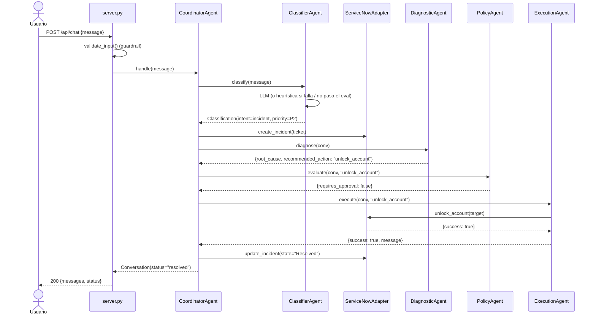
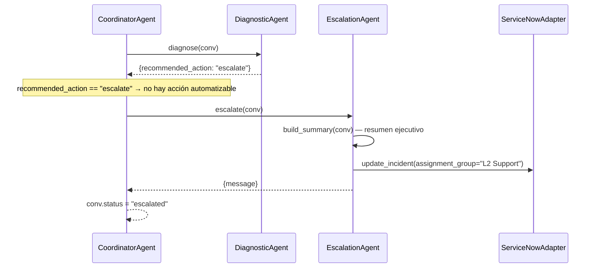

# Nivel 4 — Código

El nivel más detallado de C4: clases y flujos concretos de las partes más
importantes del sistema. No pretende ser exhaustivo — cubre lo que un
diagrama de clases o de secuencia explica mejor que prosa.

## Modelo de dominio (`backend/core/models.py`)

`status` de `Conversation` es una máquina de estados simple (`str`, no un
enum tipado): `in_progress → resolved | escalated | awaiting_approval`.

## Jerarquía de excepciones (`backend/llmops/errors.py`)

`backend/server.py` mapea esta jerarquía a HTTP vía
`@app.exception_handler`: `ProviderError` → 502, `AgentError` → 500,
cualquier otro `LLMOpsError` → 500 genérico — nunca un traceback crudo.

## Secuencia — camino feliz (incidente resuelto por autoservicio)

## Secuencia — escalación automática

Se dispara en dos puntos distintos de `CoordinatorAgent`, ambos sin
intervención manual (ver `tests/test_coordinator_escalation.py`):

El segundo disparador es simétrico: si `ExecutionAgent.execute()` devuelve
`{"success": false}` (acción no soportada, o falla la operación real),
`Coordinator` llama a `Escalation` de la misma forma — nunca marca la
conversación como `resolved` sobre un resultado fallido. Antes de la
corrección documentada en la auditoría LLMOps, `Coordinator` no invocaba a
`EscalationAgent` en ningún camino automático; estos dos disparadores son
exactamente la regresión que cubren los tests.
